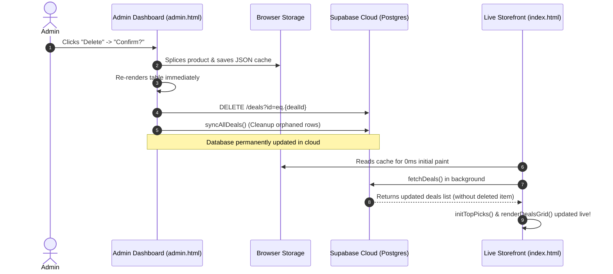

# DealNest (SmartNest Guide) — Complete Project Documentation & Architecture Guide

A comprehensive, end-to-end guide explaining how this Amazon Affiliate Hub is built from scratch, how the database connects, the technologies used, and how to maintain, deploy, and scale it.

---

## 📑 Table of Contents
1. [Project Overview & Core Mission](#1-project-overview--core-mission)
2. [Technology Stack & Architectural Decisions](#2-technology-stack--architectural-decisions)
3. [File & Directory Architecture](#3-file--directory-architecture)
4. [Database Design & Supabase Setup (From Scratch)](#4-database-design--supabase-setup-from-scratch)
5. [Connecting Database to Frontend (`supabase-client.js`)](#5-connecting-database-to-frontend-supabase-clientjs)
6. [Public Storefront Implementation (`index.html` & `main.js`)](#6-public-storefront-implementation-indexhtml--mainjs)
7. [Admin Portal Implementation (`admin.html`)](#7-admin-portal-implementation-adminhtml)
8. [Automatic Amazon Affiliate Tracking Injection](#8-automatic-amazon-affiliate-tracking-injection)
9. [Data Flow: Read, Write, Delete & Cache Sync](#9-data-flow-read-write-delete--cache-sync)
10. [Deployment & Production Hosting (Vercel + GitHub)](#10-deployment--production-hosting-vercel--github)
11. [Troubleshooting, Security & Maintenance](#11-troubleshooting-security--maintenance)

---

## 1. Project Overview & Core Mission

**DealNest** is a high-performance, mobile-first Amazon Affiliate Hub and deals aggregator. It is optimized for social media bio links (Instagram, TikTok, YouTube, Pinterest) where users expect:
- **Instant load times** (< 500ms initial render)
- **High visual conversion rates** (modern card layouts, clear discount tags, top-pick carousels)
- **Direct Amazon conversion** (automatic affiliate tag injection into every link and Amazon search fallback)
- **Zero-code administrative control** (adding, editing, and deleting deals via a private dashboard that instantly updates the site globally).

---

## 2. Technology Stack & Architectural Decisions

| Layer | Technology | Why We Used It |
|---|---|---|
| **Structure** | **HTML5 Semantic Markup** | Lightweight, accessible, search-engine indexable, and no build pipeline required. |
| **Styling** | **Vanilla CSS3 (Design Tokens)** | Custom CSS variables for ultra-clean themes (Ivory, Deep Green, Warm Orange, Sage), high mobile responsiveness, and zero bundle bloat. |
| **Frontend Logic** | **Vanilla ES6+ JavaScript** | Zero framework overhead (no React/Next.js hydration delays). Runs instantly on all mobile WebViews. |
| **Backend / Database** | **Supabase (PostgreSQL + PostgREST)** | Serverless Postgres database providing RESTful CRUD endpoints out of the box, with built-in Row Level Security (RLS). |
| **Cloud Client** | **`@supabase/supabase-js` (via CDN)** | Allows direct database interaction from browser scripts using an Anonymous Key without spinning up an intermediate Node.js server. |
| **Local Fallback** | **Browser `localStorage`** | Provides instant UI rendering while background cloud sync fetches the latest deals, ensuring 100% offline tolerance. |
| **Hosting & CI/CD** | **Vercel + GitHub** | Automatic deployment on every `git push origin main`. Global edge CDN caching. |

---

## 3. File & Directory Architecture

```
Amazon/
│
├── index.html              # Customer-facing storefront
├── admin.html              # Password-protected admin dashboard
├── style.css               # Design system, CSS variables, and responsive layout
├── main.js                 # Storefront controller (search, filters, cloud data fetch)
├── affiliate-config.js     # Default fallback catalog, categories & hero banners
├── supabase-client.js      # Supabase database client, CRUD helper functions
├── supabase-schema.sql     # SQL database schema and security policies
├── vercel.json             # Vercel deployment configuration (clean URLs)
├── package.json            # Project metadata & npm scripts
└── README.md               # Quick-start manual
```

---

## 4. Database Design & Supabase Setup (From Scratch)

The backend runs on **Supabase**, an open-source Firebase alternative powered by PostgreSQL.

### Step 1: Create a Free Supabase Project
1. Go to [supabase.com](https://supabase.com) and log in.
2. Click **"New Project"**.
3. Choose a project name (e.g. `dealnest-db`), set a database password, and select your region.
4. Once deployed, open **Settings -> API** and copy:
   - **Project URL** (e.g., `https://xyzcompany.supabase.co`)
   - **anon / public key** (JWT token used for safe client-side queries)

### Step 2: Database Tables Schema
Open the **SQL Editor** in Supabase dashboard and run [`supabase-schema.sql`](file:///c:/Users/shame/Amazon/supabase-schema.sql):

```sql
-- 1. Create the 'deals' table
CREATE TABLE IF NOT EXISTS public.deals (
  id TEXT PRIMARY KEY,
  title TEXT NOT NULL,
  category TEXT DEFAULT 'amazon-deals',
  store TEXT DEFAULT 'Amazon',
  original_price TEXT,
  deal_price TEXT,
  discount TEXT,
  rating TEXT DEFAULT '4.8',
  reviews_count TEXT DEFAULT '1,000+',
  badge TEXT DEFAULT '🔥 Top Deal',
  image TEXT,
  affiliate_url TEXT,
  is_top_pick BOOLEAN DEFAULT false,
  sort_order INTEGER DEFAULT 0,
  updated_at TIMESTAMP WITH TIME ZONE DEFAULT timezone('utc'::text, now()) NOT NULL
);

-- 2. Create the 'site_settings' table (for Amazon tag, banner headlines, etc.)
CREATE TABLE IF NOT EXISTS public.site_settings (
  key TEXT PRIMARY KEY,
  value TEXT NOT NULL,
  updated_at TIMESTAMP WITH TIME ZONE DEFAULT timezone('utc'::text, now()) NOT NULL
);
```

### Step 3: Row Level Security (RLS) Policies
Because the frontend connects directly via the client without a custom backend server, we configure PostgreSQL Row Level Security to allow public reading and management via the `anon` key:

```sql
-- Enable RLS
ALTER TABLE public.deals ENABLE ROW LEVEL SECURITY;
ALTER TABLE public.site_settings ENABLE ROW LEVEL SECURITY;

-- Allow anyone to view deals & settings (Public read)
CREATE POLICY "Public can read deals" ON public.deals FOR SELECT USING (true);
CREATE POLICY "Public can read settings" ON public.site_settings FOR SELECT USING (true);

-- Allow Admin dashboard to Insert, Update, and Delete
CREATE POLICY "Public can insert deals" ON public.deals FOR INSERT WITH CHECK (true);
CREATE POLICY "Public can update deals" ON public.deals FOR UPDATE USING (true);
CREATE POLICY "Public can delete deals" ON public.deals FOR DELETE USING (true);
CREATE POLICY "Public can insert settings" ON public.site_settings FOR INSERT WITH CHECK (true);
CREATE POLICY "Public can update settings" ON public.site_settings FOR UPDATE USING (true);
```

---

## 5. Connecting Database to Frontend (`supabase-client.js`)

[`supabase-client.js`](file:///c:/Users/shame/Amazon/supabase-client.js) bridges the web browser and the Supabase PostgreSQL database.

### 1. Initializing the Client
The Supabase JavaScript SDK is imported via CDN in HTML:
```html
<script src="https://cdn.jsdelivr.net/npm/@supabase/supabase-js@2"></script>
<script src="supabase-client.js"></script>
```

In `supabase-client.js`:
```javascript
window.SUPABASE_CONFIG = {
  url: 'https://your-project-id.supabase.co',
  anonKey: 'eyJhbGciOiJIUzI1NiIsInR5cCI6IkpXVCJ9...'
};

function getSupabaseClient() {
  if (_supabaseInstance) return _supabaseInstance;
  const cfg = getActiveSupabaseConfig();
  if (window.supabase && typeof window.supabase.createClient === 'function') {
    _supabaseInstance = window.supabase.createClient(cfg.url, cfg.anonKey);
    return _supabaseInstance;
  }
  return null;
}
```

### 2. Fetching Deals
```javascript
async function fetchDealsFromSupabase() {
  const client = getSupabaseClient();
  if (!client) return null;

  const { data, error } = await client
    .from('deals')
    .select('*')
    .order('sort_order', { ascending: true })
    .order('updated_at', { ascending: false });

  if (error) return null;

  // Map database snake_case columns to frontend camelCase properties
  return data.map(row => ({
    id: row.id,
    title: row.title,
    category: row.category,
    store: row.store || 'Amazon',
    originalPrice: row.original_price,
    dealPrice: row.deal_price,
    discount: row.discount,
    rating: row.rating || '4.8',
    reviewsCount: row.reviews_count || '1,000+',
    badge: row.badge || '🔥 Top Deal',
    image: row.image,
    affiliateUrl: row.affiliate_url || '',
    isTopPick: Boolean(row.is_top_pick),
    sortOrder: row.sort_order || 0
  }));
}
```

### 3. Deleting Deals Permanently
```javascript
async function deleteDealFromSupabase(dealId) {
  const client = getSupabaseClient();
  if (!client) return { success: false, error: 'Supabase not connected' };

  try {
    const { data, error } = await client
      .from('deals')
      .delete()
      .eq('id', dealId);

    if (error) throw error;
    return { success: true, data };
  } catch (err) {
    return { success: false, error: err.message };
  }
}
```

### 4. Full Catalog Synchronization
When deals are edited or rearranged in bulk, `syncAllDealsToSupabase` upserts all active products and automatically prunes any deleted IDs from the database:
```javascript
async function syncAllDealsToSupabase(products, amazonTag) {
  const client = getSupabaseClient();
  
  // 1. Upsert active products
  const rows = products.map((deal, idx) => ({ ... }));
  if (rows.length > 0) {
    await client.from('deals').upsert(rows, { onConflict: 'id' });
  }

  // 2. Query existing IDs and delete any that were removed
  const activeIds = products.map(p => p.id).filter(Boolean);
  const { data: existingRows } = await client.from('deals').select('id');
  if (Array.isArray(existingRows)) {
    const toDeleteIds = existingRows.map(r => r.id).filter(id => !activeIds.includes(id));
    for (const delId of toDeleteIds) {
      await client.from('deals').delete().eq('id', delId);
    }
  }
  return { success: true };
}
```

---

## 6. Public Storefront Implementation (`index.html` & `main.js`)

### 1. Storefront Component Hierarchy
1. **Sticky Header**: Brand logo, universal search bar, mobile hamburger menu toggle.
2. **Hero Carousel**: High-impact promotional slides with coupon codes and CTA links.
3. **Top Picks Slider**: Horizontal scrolling tray for editor-selected deals (`isTopPick: true`).
4. **Taxonomy Filters**: Scrollable pills filtering categories (`All`, `Amazon Deals`, `Branded Deals`, `Clothing`, `Electronics`, `Furniture`, `Household & Kitchen`, `Kids`, `Shoes`).
5. **Main Deals Grid**: Responsive card grid with lazy-loaded images, badges, price comparison, and automatic affiliate tracking links.
6. **Footer**: Affiliate disclosure, copyright, and subtle link to `/admin.html`.

### 2. Dual-Layer Asynchronous Data Loading
To achieve instantaneous page loads, `main.js` operates on a two-tier strategy:
1. **Tier 1 (Instant)**: Reads immediately from `localStorage` or `affiliate-config.js` and renders the UI in 0 milliseconds.
2. **Tier 2 (Cloud Update)**: In the background, `loadCloudData()` executes:
   ```javascript
   async function loadCloudData() {
     if (window.DealNestDB && window.DealNestDB.isConfigured()) {
       const [cloudDeals, cloudSettings] = await Promise.all([
         window.DealNestDB.fetchDeals(),
         window.DealNestDB.fetchSettings()
       ]);
       if (Array.isArray(cloudDeals)) {
         config.products = cloudDeals;
         initTopPicks();       // Refresh Top Picks carousel
         renderDealsGrid();    // Refresh Main Grid
       }
     }
   }
   ```

---

## 7. Admin Portal Implementation (`admin.html`)

The Admin dashboard allows non-technical managers to manage deals without code.

### 1. Password Protection (Client Authentication)
- Access is guarded by a session-based passcode (`saconsultantandstaffing1`).
- Successful entry sets `sessionStorage.setItem('dealnest_admin_auth_unlocked', 'true')`.
- Reloading the browser preserves the session without asking for the password again until the browser tab closes.

### 2. Reliable 2-Click Inline Delete Flow
To eliminate native browser `window.confirm()` popup blocking on mobile browsers and WebViews, deletion uses a safe inline two-click confirmation:
```javascript
// Click 1: Button turns red and asks "⚠️ Confirm?"
if (!btn.classList.contains('confirming')) {
  btn.classList.add('confirming');
  btn.textContent = '⚠️ Confirm?';
  setTimeout(() => { btn.classList.remove('confirming'); btn.textContent = 'Delete'; }, 4000);
  return;
}

// Click 2: Deletes immediately
products.splice(targetIdx, 1);
renderDealsList();
await window.DealNestDB.deleteDeal(toDelete.id);
await window.DealNestDB.syncAllDeals(products, adminData.amazonTag);
```

### 3. Adding New Deals
The "Add New Deal" form dynamically builds a product object:
- Automatically stamps a unique timestamp ID: `'deal-' + Date.now()`
- Normalizes prices, badges, categories, and image URLs.
- Prepends to `products.unshift(newProduct)`.
- Dispatches immediate upload to Supabase Cloud.

---

## 8. Automatic Amazon Affiliate Tracking Injection

Both `admin.html` and `main.js` feature automatic tracking tag enforcement using `buildAffiliateUrl()`:

```javascript
function buildAffiliateUrl(rawUrl, searchKeyword = '') {
  const tag = config.amazonTag || 'smartnest-20';

  // If no URL provided, create search fallback
  if (!rawUrl || rawUrl.startsWith('#')) {
    if (searchKeyword) {
      return `https://www.amazon.com/s?k=${encodeURIComponent(searchKeyword)}&tag=${encodeURIComponent(tag)}`;
    }
    return `https://www.amazon.com/?tag=${encodeURIComponent(tag)}`;
  }

  // If Amazon URL, cleanly inject or replace ?tag= parameter
  try {
    const urlObj = new URL(rawUrl);
    if (urlObj.hostname.includes('amazon.')) {
      urlObj.searchParams.set('tag', tag);
      return urlObj.toString();
    }
  } catch (e) {
    return rawUrl;
  }
  return rawUrl;
}
```

---

## 9. Data Flow: Read, Write, Delete & Cache Sync



---

## 10. Deployment & Production Hosting (Vercel + GitHub)

### Step 1: Push Project to GitHub
```bash
git add .
git commit -m "Initial commit of Amazon Affiliate Hub"
git branch -M main
git remote add origin https://github.com/YOUR_USERNAME/amazon.git
git push -u origin main
```

### Step 2: Deploy to Vercel
1. Go to [vercel.com](https://vercel.com) and click **"Add New Project"**.
2. Select your GitHub repository (`amazon`).
3. Framework Preset: **Other** (Static HTML).
4. Click **Deploy**.
5. Vercel automatically assigns an SSL domain (e.g. `your-store.vercel.app`).
6. Because [`vercel.json`](file:///c:/Users/shame/Amazon/vercel.json) specifies `{ "cleanUrls": true }`, URLs like `/admin` and `/index` work cleanly without `.html` extensions.

---

## 11. Troubleshooting, Security & Maintenance

### 1. Changing the Admin Password
Open [`admin.html`](file:///c:/Users/shame/Amazon/admin.html) line 752:
```javascript
const ADMIN_PASS = 'your-new-secure-password';
```
Save, commit, and push to GitHub.

### 2. Updating Your Amazon Associates Tracking ID
- **Option A (No-code)**: In `admin.html`, edit the **Amazon Associates Tracking Tag** input field and click **"Save Tag"**. This writes to Supabase `site_settings` table.
- **Option B (Code default)**: In [`affiliate-config.js`](file:///c:/Users/shame/Amazon/affiliate-config.js) line 16, update `amazonTag: "yourtag-20"`.

### 3. Fixing Broken Product Images
- Amazon short URLs like `https://a.co/d/...` are product page links, **not** direct image files.
- Always use direct image URLs ending in `.jpg`, `.png`, or `media-amazon.com/images/...`.
- If an image link ever fails, [`main.js`](file:///c:/Users/shame/Amazon/main.js) automatically substitutes a graceful fallback via `onerror="this.onerror=null; this.src='...'"` so cards never display broken layout icons.
